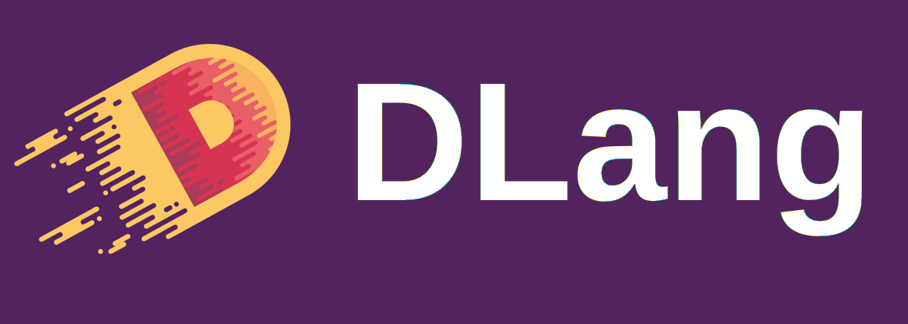

D Artwork
=========

This repository is a collection of D artwork, themes and branding.

Logo with background
---------------------

  

Logo transparent
----------------

  

Favicon
-------

Read the [favicon README](https://github.com/dlang-community/artwork/tree/master/favicon).

DLang Banner
------------

  

License
--------

The DConf logo and artwork has been created by Sociomantic for the D Language Foundation.
It is released under the [Attribution-ShareAlike 4.0 International (CC BY-SA 4.0)](https://creativecommons.org/licenses/by-sa/4.0/).
